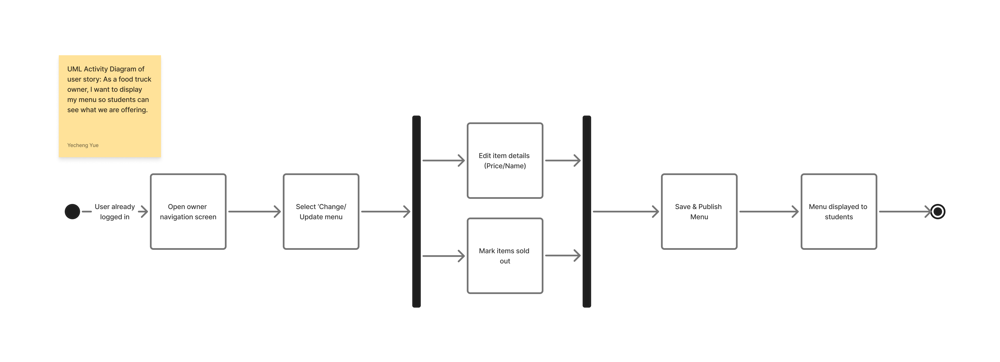
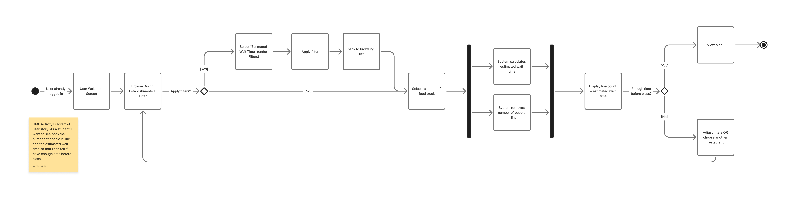

# Specification Phase Exercise

A little exercise to get started with the specification phase of the software development lifecycle. See the [instructions](instructions.md) for more detail.

## Team members

[Lan Nguyen](https://github.com/lpn4939-web)

[Milan Engineer](https://github.com/MilanEngineer)

[Claire Wu](https://github.com/clairewwwwww)

[Yecheng Yue Eddy](https://github.com/YechengYueEddy)

See instructions. Delete this line and replace with a list of the names of your team members, including links to each one's GitHub profile.

## Stakeholders

Heather (Student):

- She doesn't visit food trucks often because there are small time gaps so she couldn’t wait.
- The line can be so long, and she would not be willing to wait.
- She pays by cards, but sometimes there’d be a surcharge if she doesn't have cash on hand.

Chase (Student):

- Food trucks change and relocate frequently on campus, but the same one consistently shows up. So he would like to see updates on a map.
- As someone who studies who study in Bobst, it's hard to predict if the food trucks outside are busy and it's too much work to get the food and wait.
- He said it would be great if there's an order in advance, and he see the menu prices

Fandianr (Purple food truck) that has been operating on campus for more than 15 years:

- They worry about in-person and mobile orders, as the workflow can get really chaotic
- With order pickup, by the time students arrive to pick it up, the food will have already gotten cold.
- Some items can be served right away, but others need to be fried on the spot
- Students like seeing that fried food is made fresh, and they wants everything to be served hot.

## Product Vision Statement

Violet Order is the fastest way for NYU students to discover food trucks, see real wait times, and order ahead, while giving vendors the tools to sell smarter.

## User Requirements

### User Stories (student users)

1. As a student, I want to see both the number of people in line and the estimated wait time so that I can tell if I have enough time before class.
2. As a student, I want to see which nearby spots are least crowded so that I can avoid traffic.
3. As a student, I want to see whether a food truck or coffee shop is open right now so that I don’t waste time going to a closed spot.
4. As a student, I want to sort by the current wait time for food trucks so that I can choose the fastest one.
5. As a student, I want to see photos of food so that I can decide what I want without only looking at the text.
6. As a student, I want to see ratings for each food truck or coffee shop so that I can choose a place that is good.
7. As a student, I want to sort by rating so that I can find the places with high ranking quickly.
8. As a student, I want to sort by distance so that I can choose the closest option when I’m in a rush.
9. As a student, I want to filter by price range so that I can find options that fit my budget.
10. As a student, I want to leave a quick rating after I buy food so that I can help other students decide.

## Activity Diagrams

### User Story 1 (Owner)

> As a food truck owner, I want to display my menu so students can see what we are offering.

### User Story 2 (Student)

> As a student, I want to see both the number of people in line and the estimated wait time so that I can tell if I have enough time before class.

## App Map

[Link to App Map](https://www.figma.com/board/cC467L0wpP4yfQ6Z2TBbHx/Ferrets---App-Map?node-id=0-1&t=yEcCibiD367jAKU4-1)

## Clickable Prototype

[Link to prototype](https://www.figma.com/proto/hwK3UMYHmqoiKUpKhcNveK/Ferrets---Prototype?node-id=159-1980&t=j29OjTxtzf00ccwI-1)
